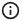
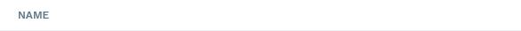
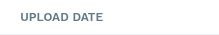

# Accessibility Audit Report

**Overview**

- URL:
  https://prodtest3.prounlimited.com/wand/app/manager/index.html#/manager/engagement/sow/7502759/details
- Scan Timestamp (UTC): 2025-11-10T21:04:47Z
- Standard: WCAG 2.1 A/AA
- Browser: Chromium Desktop (desktop viewport 1440x900)
- Total Violations: 3
- Total Affected Nodes: 11
- Impact Breakdown: Critical 1 | Serious 2 | Moderate 0 | Minor 0

## 1. Executive Summary

- Accessibility Score: 80.00
- Total Violations: 3
- Impact Distribution: Critical 33% | Serious 67% | Moderate 0% | Minor 0%
- Thematic Issues:
  - Missing alternative text on meaningful imagery.
  - Misuse of ARIA (aria-label applied to elements without appropriate roles).
  - Insufficient color contrast for table header text (just below 4.5:1 threshold).
- Highest Risk: Missing `alt` text (blocks non-visual users), systemic ARIA misuse pattern,
  pervasive contrast issue in header cells.
- Recommended Immediate Focus: Add descriptive `alt` text or mark decorative images as
  presentational; correct ARIA usage by removing inappropriate `aria-label` or adding proper
  roles; adjust header text color for ≥4.5:1 contrast.

## 2. Score & Issue Overview

| Accessibility Score | Total Violations | Critical | Serious | Moderate | Minor | Total Affected Nodes |
| ------------------- | ---------------- | -------- | ------- | -------- | ----- | -------------------- |
| 80.00               | 3                | 1        | 2       | 0        | 0     | 11                   |

## 3. Detailed Violations

### Critical Violation: image-alt

- Help: Images must have alternative text
- Description: Ensure  elements have alternative text or a role of none or presentation
- Impact: critical
- Affected Nodes: 1

| #   | Selector       | HTML Snippet                                                                  | Failure Summary                                                                         | Screenshot                                                                  |
| --- | -------------- | ----------------------------------------------------------------------------- | --------------------------------------------------------------------------------------- | --------------------------------------------------------------------------- |
| 1   | .profile-photo | `` | Element does not have an alt attribute; no aria-label/labelledby; not marked decorative |  |

**Why This Matters**  
Screen reader users rely on alternative text to understand the purpose or content of images.
Missing alt text creates silent gaps or announces raw filenames, degrading task efficiency and
comprehension.

**How to Fix**

1. If the image conveys user identity or status, add a concise descriptive
   `alt="Client profile"` (or equivalent meaningful text).
2. If purely decorative, add `alt=""` or `role="presentation"`.
3. Ensure no redundant text (avoid duplicating adjacent visible label).
4. Validate that dynamically loaded images preserve `alt` attributes after any re-render.

**Validation Checklist**

- [ ] All meaningful images have non-empty `alt` text
- [ ] Decorative images use empty `alt` or presentation role
- [ ] No filename-like alt values
- [ ] No duplicated information between adjacent text and alt
- [ ] Post-render DOM still contains required attributes

---

### Serious Violation: aria-prohibited-attr

- Help: Elements must only use permitted ARIA attributes
- Description: Ensure ARIA attributes are not prohibited for an element's role
- Impact: serious
- Affected Nodes: 7

| #   | Selector                                                                                            | HTML Snippet                                | Failure Summary                                                  | Screenshot                                                                  |
| --- | --------------------------------------------------------------------------------------------------- | ------------------------------------------- | ---------------------------------------------------------------- | --------------------------------------------------------------------------- |
| 1   | .table-row:nth-child(1) > .name-cell > .name-with-icon > .download-icon-link[aria-label="Download"] | `<a ... class="download-icon-link">`        | aria-label cannot be used on a anchor without valid role context |  |
| 2   | .table-row:nth-child(2) > .name-cell > .name-with-icon > .download-icon-link[aria-label="Download"] | `<a ... class="download-icon-link">`        | aria-label cannot be used on a anchor without valid role context |  |
| 3   | span[aria-label="Estimated Budget Info"]                                                            | `` | aria-label on span with no valid role                            |  |
| 4   | span[aria-label="Budget Information"]                                                               | `` | aria-label on span with no valid role                            |  |
| 5   | span[aria-label="Project Budget Information"]                                                       | `` | aria-label on span with no valid role                            |  |
| 6   | span[aria-label="Invoiced & Committed Info"]                                                        | `` | aria-label on span with no valid role                            |  |
| 7   | span[aria-label="Available Funds Info"]                                                             | `` | aria-label on span with no valid role                            |  |

**Why This Matters**  
Incorrect ARIA usage pollutes the accessibility tree and can cause assistive technologies to
present misleading or redundant information, increasing cognitive load and navigation errors.

**How to Fix**

1. Remove `aria-label` from elements lacking interactive or landmark semantics.
2. If an element is interactive (e.g., behaves like a button), convert `` to a semantic
   `<button>` or add appropriate role plus keyboard handlers (`role="button"` with
   Enter/Space).
3. For purely decorative icons triggering tooltips, rely on the tooltip's accessible text
   (`aria-describedby`) rather than `aria-label`.
4. Ensure anchor elements have valid `href` or intended role if repurposed.
5. Centralize icon-button component enforcing correct base element and ARIA patterns.

**Validation Checklist**

- [ ] No `aria-label` on non-interactive plain spans
- [ ] Interactive affordances use semantic elements (`<button>`, `<a href>`).
- [ ] Keyboard activation (Enter/Space) works for custom interactive elements
- [ ] Accessibility tree inspected to confirm cleaned naming
- [ ] Tooltip text announced once, not duplicated

---

### Serious Violation: color-contrast

- Help: Elements must meet minimum color contrast ratio thresholds
- Description: Ensure the contrast between foreground and background colors meets WCAG 2 AA
  minimum contrast ratio thresholds
- Impact: serious
- Affected Nodes: 3

| #   | Selector        | HTML Snippet                        | Failure Summary                                                    | Screenshot                                                                  |
| --- | --------------- | ----------------------------------- | ------------------------------------------------------------------ | --------------------------------------------------------------------------- |
| 1   | .th-name        | `<th ... class="th-name">Name</th>` | Insufficient contrast 4.49 (fg #637a89 on #ffffff) vs required 4.5 |  |
| 2   | th:nth-child(2) | `<th ...>Type</th>`                 | Insufficient contrast 4.49 (fg #637a89 on #ffffff)                 |  |
| 3   | th:nth-child(3) | `<th ...>Upload Date</th>`          | Insufficient contrast 4.49 (fg #637a89 on #ffffff)                 |  |

**Why This Matters**  
Low contrast text is difficult to read for users with low vision, glare, or color vision
deficiencies, increasing cognitive strain and task completion time.

**How to Fix**

1. Darken header text color to ≥ #566976 or #516473 while keeping background.
2. Alternatively lighten background (e.g., #FAFBFC) ensuring ratio ≥4.5:1.
3. Update design tokens and regenerate CSS, avoiding inline overrides.
4. Re-test all interactive states (hover, focus, sort indicators) for contrast compliance.
5. Document new palette in style guide.

**Validation Checklist**

- [ ] Adjusted color tokens meet ≥4.5:1
- [ ] Hover/focus/sort states meet ratio
- [ ] No regression in adjacent table text
- [ ] Visual QA passes in high/low brightness

**Suggested Color Adjustments**  
| Role | Current | Proposed | Contrast Rationale |
|------|---------|----------|--------------------| | Header Text | #637a89 on #FFFFFF | #566976
on #FFFFFF | Darker shade reaches ≥4.5:1 | | Secondary Header | #637a89 on #FFFFFF | #516473 on
#FFFFFF | Extra margin for future scaling |

---

## 4. Root Cause Analysis

| Area          | Issue                            | Cause                                           | Recommended Action                                      |
| ------------- | -------------------------------- | ----------------------------------------------- | ------------------------------------------------------- |
| Images        | Missing alt text                 | Image component lacks alt enforcement           | Enforce alt via wrapper; add lint rule                  |
| Icon Tooltips | ARIA misuse (`aria-label` spans) | Overreliance on aria-label for tooltip triggers | Refactor to semantic buttons or remove redundant labels |
| Table Headers | Low contrast                     | Palette gray too light at small size            | Darken foreground token; verify states                  |

## 5. Prioritized Remediation Plan

| Priority | Task                                                                 | Impact Addressed                 | Effort | Notes                       |
| -------- | -------------------------------------------------------------------- | -------------------------------- | ------ | --------------------------- |
| High     | Add alt or mark decorative for profile image                         | image-alt                        | Low    | Single element change       |
| High     | Refactor tooltip/icon spans to semantic buttons or remove aria-label | aria-prohibited-attr             | Medium | Component refactor          |
| Medium   | Update header text color tokens                                      | color-contrast                   | Low    | Token change, cascade check |
| Low      | Add lint rules (alt enforcement, ARIA hygiene)                       | image-alt / aria-prohibited-attr | Medium | Prevent regressions         |

## 6. Testing & Verification Plan

1. Implement alt text fix; rerun audit (expect image-alt removed).
2. Refactor ARIA misuse; verify with accessibility tree inspector and screen reader.
3. Adjust color tokens; validate contrast with tooling (>=4.5:1).
4. Rerun `a11y_audit_page` and compare node counts.
5. Add automated lint rules; run CI to confirm gating.
6. Manual NVDA or VoiceOver pass focusing on icon buttons and table headers.

## 7. Developer Implementation Checklist

- [ ] Alt text added or image marked decorative.
- [ ] Tooltip/icon spans replaced or ARIA cleaned.
- [ ] Color tokens updated and documented.
- [ ] Audit re-run and improvements verified.
- [ ] Lint rules merged and active in CI.
- [ ] Screen reader manual test logged.

## 8. Appendix

References:

- WCAG 2.1 SC 1.1.1 (Non-text Content)
- WCAG 2.1 SC 1.4.3 (Contrast Minimum)
- WCAG 2.1 SC 4.1.2 (Name, Role, Value)
- WAI-ARIA Authoring Practices
- Axe Core Documentation (image-alt, aria-prohibited-attr, color-contrast)

## 9. Final Notes

Address the alt text and ARIA misuse first to remove structural barriers, then finalize color
adjustments for readability. Re-run audits post-fix deployment and schedule a follow-up scan
after any major UI changes.

