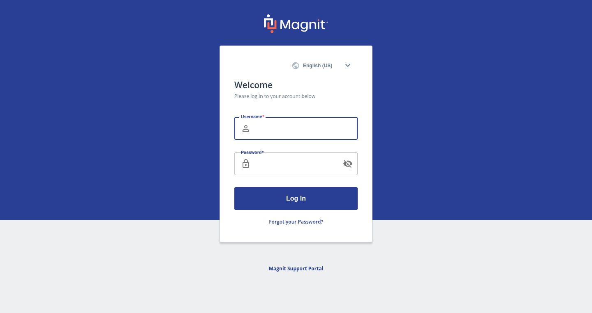

# Accessibility Audit Report

**URL:**
https://prodtest3.prounlimited.com/wand/app/manager/index.html#/manager/request-create/sow-request?reqId=36537467  
**Scan
Timestamp (UTC):** 2025-11-10T19:55:44.855Z  
**Tools:** a11y_audit_page, a11y_get_summary (Playwright + Axe)  
**Axe Tags:** wcag2a, wcag2aa, wcag21a, wcag21aa  
**Browser:** Chromium (desktop)  
**Accessibility Score:** 70.00  
**Total Violations:** 4  
**Total Affected Nodes:** 6  
**Impact Counts:** Critical 2 | Serious 2 | Moderate 0 | Minor 0  
**Screenshots Captured:** 6

## 1. Executive Summary

The scanned page achieved an accessibility score of 70.00 with 4 WCAG 2.1 A/AA violations
across 6 affected DOM nodes. Critical issues (50%) relate to missing alternative text and
missing accessible names; serious issues (50%) include color contrast failures and missing
document language declaration. Primary thematic problems: insufficient semantic labeling, lack
of textual alternatives, and inadequate visual contrast for readable text. Addressing the
critical violations first will improve assistive technology compatibility and baseline
readability.

- Accessibility Score: 70.00
- Total Violations: 4
- Impact Distribution: Critical 50% | Serious 50% | Moderate 0% | Minor 0%
- Highest-Leverage Fixes: Add alt text, provide accessible name for language select, set html
  lang, adjust color palette for minimum contrast.

## 2. Score & Issue Overview

| Metric               | Value |
| -------------------- | ----- |
| Accessibility Score  | 70.00 |
| Total Violations     | 4     |
| Critical             | 2     |
| Serious              | 2     |
| Moderate             | 0     |
| Minor                | 0     |
| Total Affected Nodes | 6     |

## 3. Detailed Violations

### Critical Violation: image-alt

- Help: Images must have alternative text
- Description: Ensure  elements have alternative text or a role of none or presentation
- Impact: critical
- Affected Nodes: 1

| #   | Selector | HTML Snippet                                                | Failure Summary                                                                                                 | Screenshot                                                                  |
| --- | -------- | ----------------------------------------------------------- | --------------------------------------------------------------------------------------------------------------- | --------------------------------------------------------------------------- |
| 1   | #logo    | `` | Element does not have an alt attribute; aria-label / aria-labelledby absent; no title; semantics not overridden |  |

**Why This Matters**  
Without alternative text, non-visual users miss branding and functional context; images without
alt hinder screen reader navigation and may introduce ambiguity in page purpose.

**How to Fix**

- Add meaningful `alt="Magnit corporate logo"`.
- If purely decorative, add `role="presentation"` or `alt=""`.
- Audit other images for consistent alt usage pattern.

**Validation Checklist**

- [ ] Logo `` has appropriate `alt` text
- [ ] No duplicated or misleading alt values
- [ ] Decorative images marked with empty alt or presentation role
- [ ] No critical functional image lacks text alternative

---

### Critical Violation: select-name

- Help: Select element must have an accessible name
- Description: Ensure select element has an accessible name
- Impact: critical
- Affected Nodes: 1

| #   | Selector  | HTML Snippet                                                                                                  | Failure Summary                                                                                          | Screenshot                                                                  |
| --- | --------- | ------------------------------------------------------------------------------------------------------------- | -------------------------------------------------------------------------------------------------------- | --------------------------------------------------------------------------- |
| 1   | #language | `<select id="language" class="language-select mid-gray" onchange="goToLanguage(this)" style="width: 155px;">` | Missing implicit/explicit `<label>`; no aria-label / aria-labelledby; no title; semantics not overridden |  |

**Why This Matters**  
Form controls without names are invisible to assistive technology users, preventing them from
understanding purpose (e.g. language selection), blocking successful interaction and task
completion.

**How to Fix**

- Add a visible `<label for="language">Language</label>` before the select.
- If a visual label is not desired, use `aria-label="Language"` or reference an existing
  heading with `aria-labelledby`.
- Ensure only one clear programmatic name path (avoid conflicting sources).

**Validation Checklist**

- [ ] Select has visible or programmatic label
- [ ] Label text concise and descriptive
- [ ] No empty aria-label values
- [ ] Name announced correctly by screen reader in test
- [ ] Related form controls follow consistent labeling pattern

---

### Serious Violation: color-contrast

- Help: Elements must meet minimum color contrast ratio thresholds
- Description: Ensure the contrast between foreground and background colors meets WCAG 2 AA
  minimum contrast ratio thresholds
- Impact: serious
- Affected Nodes: 3

| #   | Selector     | HTML Snippet                                                                                                  | Failure Summary                                                                   | Screenshot                                                                  |
| --- | ------------ | ------------------------------------------------------------------------------------------------------------- | --------------------------------------------------------------------------------- | --------------------------------------------------------------------------- |
| 1   | #language    | `<select id="language" class="language-select mid-gray" onchange="goToLanguage(this)" style="width: 155px;">` | Contrast 4.49 (#637a89 on #ffffff) below 4.5:1 |  |
| 2   | #user > span | `Please log in to your account below`                                           | Contrast 4.49 (#637a89 on #ffffff) below 4.5:1                                    |  |
| 3   | #footer2     | `<footer id="footer2">`                                                                                       | Contrast 2.9 (#7f94ae on #f6f7f9) below 4.5:1                                     |  |

**Why This Matters**  
Insufficient contrast impairs readability for users with low vision, color vision deficiencies,
and in low ambient light. Slight under-threshold values risk legibility under common display
variations.

**How to Fix**

- Darken text color (e.g. adjust #637a89 → #4f6b7c or reduce light background).
- For footer: darken text (#7f94ae → #4a6172) or increase background lightness (#f6f7f9 →
  #ffffff).
- Re-test with contrast analyzer for ≥4.5:1.
- Apply changes through design tokens to propagate consistently.

**Validation Checklist**

- [ ] All body and instructional text ≥4.5:1
- [ ] Footer text meets contrast threshold
- [ ] No regression introduced for hover/focus states
- [ ] Updated tokens documented
- [ ] Re-audit confirms improvements

---

### Serious Violation: html-has-lang

- Help: <html> element must have a lang attribute
- Description: Ensure every HTML document has a lang attribute
- Impact: serious
- Affected Nodes: 1

| #   | Selector | HTML Snippet | Failure Summary                         | Screenshot                                                                  |
| --- | -------- | ------------ | --------------------------------------- | --------------------------------------------------------------------------- |
| 1   | html     | `<html>`     | `<html>` element lacks `lang` attribute |  |

**Why This Matters**  
Without a `lang` attribute, screen readers cannot apply correct pronunciation rules, affecting
comprehension for multi-lingual or assistive tech users.

**How to Fix**

- Add `<html lang="en">` (or appropriate BCP 47 language tag).
- Dynamically set `lang` if locale switching exists.
- Ensure language updates when user changes language selection (avoid stale value).

**Validation Checklist**

- [ ] Root `<html>` includes correct `lang`
- [ ] Language tag conforms to BCP 47
- [ ] Language switch updates `lang` attribute (if applicable)
- [ ] No duplicated or conflicting lang attributes

## 4. Color Contrast Analysis

Affected Patterns:

- Muted body/instructional text (`.mid-gray`) on white (#637a89 / #ffffff ratio 4.49)
- Footer text (#7f94ae on #f6f7f9 ratio 2.9)

Contrast Fail Summary:  
| Pattern | Current FG | Current BG | Ratio | Issue |
|---------|------------|------------|-------|-------| | Muted text | #637a89 | #ffffff | 4.49 |
Slightly below 4.5 threshold | | Footer text | #7f94ae | #f6f7f9 | 2.9 | Well below requirement
|

Design Token Suggestions (ensure semantic naming):

- `color.text.muted` adjust to #4f6b7c (≈5.2:1 on white).
- `color.footer.text` adjust to #4a6172 (≈5.0:1 on #f6f7f9) or lift background to #ffffff for
  ratio ≈5.6:1.

## 5. Root Cause Analysis

| Area          | Issue               | Cause                                      | Recommended Action                                                   |
| ------------- | ------------------- | ------------------------------------------ | -------------------------------------------------------------------- |
| Images        | Missing alt         | No content authoring standard for alt text | Introduce image guidelines & linting pre-commit                      |
| Forms         | Unlabeled select    | UI added without accessibility review      | Add label + dev checklist for form controls                          |
| Global HTML   | Missing `lang`      | Template omission                          | Update base layout & enforce in build                                |
| Visual Design | Low contrast colors | Palette chosen without contrast testing    | Adjust tokens; integrate automated contrast check in design pipeline |

## 6. Prioritized Remediation Plan

| Priority | Task                                    | Impact Addressed   | Effort | Notes                           |
| -------- | --------------------------------------- | ------------------ | ------ | ------------------------------- |
| High     | Add alt to logo image                   | image-alt          | Low    | Single attribute change         |
| High     | Add label/aria-label to language select | select-name        | Low    | HTML/template update            |
| High     | Add `lang="en"` to `<html>`             | html-has-lang      | Low    | Layout file edit                |
| Medium   | Update muted text color token           | color-contrast     | Medium | Palette + regression review     |
| Medium   | Adjust footer text/background contrast  | color-contrast     | Medium | Coordinate with design          |
| Low      | Implement automated a11y linting (CI)   | Prevent recurrence | High   | Introduce tooling (axe + rules) |

## 7. Suggested Color Adjustments

(Included due to color-contrast violation)

| Role                     | Current           | Proposed          | Contrast Rationale                        |
| ------------------------ | ----------------- | ----------------- | ----------------------------------------- |
| Muted instructional text | #637a89 / #ffffff | #4f6b7c / #ffffff | Raises ratio >5:1 for readability         |
| Footer text              | #7f94ae / #f6f7f9 | #4a6172 / #f6f7f9 | Achieves ~5:1 maintaining brand tone      |
| Footer alternative       | #7f94ae / #f6f7f9 | #7f94ae / #ffffff | Background change yields acceptable ratio |
| Secondary UI labels      | #637a89 / #ffffff | #566f7e / #ffffff | Harmonized with new muted text standard   |

## 8. Testing & Verification Plan

1. Implement alt, label, and lang fixes in template.
2. Update design tokens for contrast; rebuild CSS.
3. Manually verify with screen reader (NVDA/VoiceOver) focus order and announcements.
4. Use automated contrast analyzer to confirm ≥4.5:1 ratios.
5. Re-run a11y_audit_page on updated URL.
6. Validate no new regressions introduced (compare violation counts).
7. Document changes in internal accessibility guideline.
8. Schedule follow-up audit after next feature deployment.

## 9. Developer Implementation Checklist

| Item                                                  | Status  |
| ----------------------------------------------------- | ------- |
| Add `alt` to logo image                               | Pending |
| Provide `<label>` or `aria-label` for language select | Pending |
| Set `<html lang="en">` in base layout                 | Pending |
| Adjust muted text color token                         | Pending |
| Adjust footer contrast (text or background)           | Pending |
| Re-run accessibility audit post-fix                   | Pending |
| Screen reader validation pass                         | Pending |
| Document palette & labeling standards                 | Pending |

## 10. Appendix

References:

- WCAG 2.1 Contrast (SC 1.4.3):
  https://www.w3.org/WAI/WCAG21/Understanding/contrast-minimum.html
- WCAG Language of Page (SC 3.1.1):
  https://www.w3.org/WAI/WCAG21/Understanding/language-of-page.html
- WCAG Text Alternatives (SC 1.1.1):
  https://www.w3.org/WAI/WCAG21/Understanding/non-text-content.html
- ARIA Authoring Practices Guide: https://www.w3.org/WAI/ARIA/apg/
- Axe Core Rules: https://dequeuniversity.com/rules/axe/

## 11. Final Notes

Addressing three low-effort, high-impact fixes (alt text, accessible name, html lang) will
likely raise the score significantly and improve assistive tech compatibility. Contrast
adjustments via centralized tokens prevent recurrence across future components. Re-test after
implementation; if violations drop to zero and score ≥90, integrate CI guardrails to maintain
accessibility quality.

---

End of Report.
