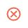
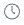
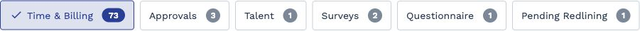
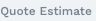
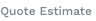
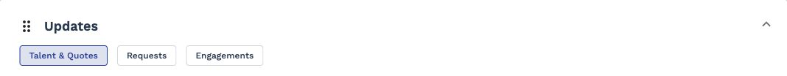
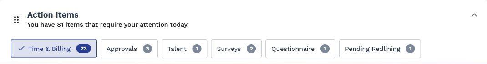
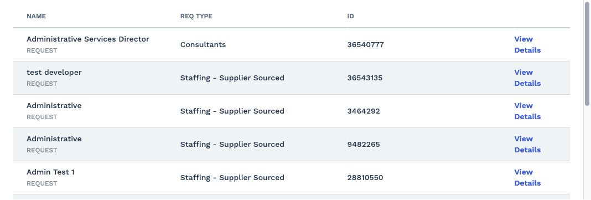

# Accessibility Audit Report

> URL: https://prodtest3.prounlimited.com/wand/app/manager/index.html#/manager/home  
> Date (UTC): 2025-11-12  
> Standard: WCAG 2.1 AA  
> Browser: Chromium Desktop  
> Total Violations: 6  
> Total Affected Nodes: 46  
> Score: 60.00

## 1. Executive Summary

- Accessibility Score: 60.00
- Total Violations: 6 (Critical: 2, Serious: 4, Moderate: 0, Minor: 0)
- Impact Distribution: Critical 33%, Serious 67%, Moderate 0%, Minor 0%
- High-Level Themes:
  - Missing accessible names on interactive elements (buttons, ARIA listboxes)
  - Unlabeled imagery used for status and action semantics
  - Insufficient color contrast for status badges and secondary text
  - Nested interactive regions (expansion panel headers with focusable descendants)
  - Scrollable region lacking keyboard focus affordance

## 2. Score & Issue Overview

| Metric | Value |
|--------|-------|
| Accessibility Score | 60.00 |
| Total Violations | 6 |
| Critical | 2 |
| Serious | 4 |
| Moderate | 0 |
| Minor | 0 |
| Total Affected Nodes | 46 |
| Impact % Critical | 33% |
| Impact % Serious | 67% |
| Impact % Moderate | 0% |
| Impact % Minor | 0% |

## 3. Detailed Violations

### Critical Violation: button-name
- Help: Buttons must have discernible text
- Description: Ensure buttons have discernible text
- Impact: critical
- Affected Nodes: 10

| # | Selector | HTML Snippet | Failure Summary |
|---|----------|--------------|----------------|
| 1 | .action-item-row.fl-gap-4.fl-item-center:nth-child(1) > .actions-column.column-6.fl-justify-end > .reject-btn.mat-icon-button[mattooltipposition="above"] | <button ... class="mat-focus-indicator mat-tooltip-trigger reject-btn mat-icon-button ..."> | Missing discernible text / accessible name |
| 2 | .action-item-row.fl-gap-4.fl-item-center:nth-child(1) > .actions-column.column-6.fl-justify-end > .approve-btn.mat-icon-button[mattooltipposition="above"] | <button ... class="mat-focus-indicator mat-tooltip-trigger approve-btn mat-icon-button ..."> | Missing discernible text / accessible name |
| 3 | .action-item-row.fl-gap-4.fl-item-center:nth-child(2) > .actions-column.column-6.fl-justify-end > .reject-btn.mat-icon-button[mattooltipposition="above"] | <button ... class="mat-focus-indicator mat-tooltip-trigger reject-btn mat-icon-button ..."> | Missing discernible text / accessible name |
| 4 | .action-item-row.fl-gap-4.fl-item-center:nth-child(2) > .actions-column.column-6.fl-justify-end > .approve-btn.mat-icon-button[mattooltipposition="above"] | <button ... class="mat-focus-indicator mat-tooltip-trigger approve-btn mat-icon-button ..."> | Missing discernible text / accessible name |
| 5 | .action-item-row.fl-gap-4.fl-item-center:nth-child(3) > .actions-column.column-6.fl-justify-end > .reject-btn.mat-icon-button[mattooltipposition="above"] | <button ... class="mat-focus-indicator mat-tooltip-trigger reject-btn mat-icon-button ..."> | Missing discernible text / accessible name |
| 6 | .action-item-row.fl-gap-4.fl-item-center:nth-child(3) > .actions-column.column-6.fl-justify-end > .approve-btn.mat-icon-button[mattooltipposition="above"] | <button ... class="mat-focus-indicator mat-tooltip-trigger approve-btn mat-icon-button ..."> | Missing discernible text / accessible name |
| 7 | .action-item-row.fl-gap-4.fl-item-center:nth-child(4) > .actions-column.column-6.fl-justify-end > .reject-btn.mat-icon-button[mattooltipposition="above"] | <button ... class="mat-focus-indicator mat-tooltip-trigger reject-btn mat-icon-button ..."> | Missing discernible text / accessible name |
| 8 | .action-item-row.fl-gap-4.fl-item-center:nth-child(4) > .actions-column.column-6.fl-justify-end > .approve-btn.mat-icon-button[mattooltipposition="above"] | <button ... class="mat-focus-indicator mat-tooltip-trigger approve-btn mat-icon-button ..."> | Missing discernible text / accessible name |
| 9 | .expanding-row > .actions-column.column-6.fl-justify-end > .reject-btn.mat-icon-button[mattooltipposition="above"] | <button ... class="mat-focus-indicator mat-tooltip-trigger reject-btn mat-icon-button ..."> | Missing discernible text / accessible name |
| 10 | .expanding-row > .actions-column.column-6.fl-justify-end > .approve-btn.mat-icon-button[mattooltipposition="above"] | <button ... class="mat-focus-indicator mat-tooltip-trigger approve-btn mat-icon-button ..."> | Missing discernible text / accessible name |

Screenshots:

**Why This Matters:** Screen reader users rely on button labels to understand available actions; unlabeled icon buttons create ambiguity and force guesswork.
**How to Fix:** Provide meaningful labels using `aria-label` or visible text spans; ensure tooltip-only text is not the sole accessible name; consider adding `Approve` inside buttons.
**Validation Checklist:**
- [ ] Each button exposes non-empty accessible name
- [ ] Name matches visual/icon intent (Approve/Reject)
- [ ] No duplicate labels causing confusion
- [ ] Tooltip not sole source of accessible name
- [ ] Icon decorative marked with `aria-hidden="true"`

### Critical Violation: image-alt
- Help: Images must have alternative text
- Description: Ensure  elements have alternative text or a role of none or presentation
- Impact: critical
- Affected Nodes: 20

| # | Selector | HTML Snippet | Failure Summary |
|---|----------|--------------|----------------|
| 1 | .profile-photo |  | Missing alternative text |
| 2 | .mat-row.cdk-row:nth-child(1) > .cdk-column-managerViewed ... > img |  | Missing alternative text |
| 3 | .mat-row.cdk-row:nth-child(3) > .cdk-column-managerViewed ... > img |  | Missing alternative text |
| 4 | .mat-row.cdk-row:nth-child(4) > .cdk-column-managerViewed ... > img |  | Missing alternative text |
| 5 | .mat-row.cdk-row:nth-child(5) > .cdk-column-managerViewed ... > img |  | Missing alternative text |
| 6 | .action-item-row:nth-child(1) > .column-1 ... > img |  | Missing alternative text |
| 7 | .action-item-row:nth-child(1) .reject-btn > .mat-button-wrapper > img |  | Missing alternative text |
| 8 | .action-item-row:nth-child(1) .approve-btn > .mat-button-wrapper > img |  | Missing alternative text |
| 9 | .action-item-row:nth-child(2) > .column-1 ... > img |  | Missing alternative text |
| 10 | .action-item-row:nth-child(2) .reject-btn > .mat-button-wrapper > img |  | Missing alternative text |
| 11 | .action-item-row:nth-child(2) .approve-btn > .mat-button-wrapper > img |  | Missing alternative text |
| 12 | .action-item-row:nth-child(3) > .column-1 ... > img |  | Missing alternative text |
| 13 | .action-item-row:nth-child(3) .reject-btn > .mat-button-wrapper > img |  | Missing alternative text |
| 14 | .action-item-row:nth-child(3) .approve-btn > .mat-button-wrapper > img |  | Missing alternative text |
| 15 | .action-item-row:nth-child(4) > .column-1 ... > img |  | Missing alternative text |
| 16 | .action-item-row:nth-child(4) .reject-btn > .mat-button-wrapper > img |  | Missing alternative text |
| 17 | .action-item-row:nth-child(4) .approve-btn > .mat-button-wrapper > img |  | Missing alternative text |
| 18 | .expanding-row > .column-1 ... > img |  | Missing alternative text |
| 19 | .expanding-row .reject-btn > .mat-button-wrapper > img |  | Missing alternative text |
| 20 | .expanding-row .approve-btn > .mat-button-wrapper > img |  | Missing alternative text |

Screenshots (subset):

**Why This Matters:** Alternative text communicates the purpose of images (status icons, action glyphs) to assistive technologies; without it functionality and state cues are lost.
**How to Fix:** Add concise `alt` text for meaningful images (e.g. `alt="Manager viewed"`, `alt="Approve"`); mark purely decorative images with `alt=""` or `role="presentation"`.
**Validation Checklist:**
- [ ] All meaningful images have descriptive `alt`
- [ ] Decorative images use empty `alt` or presentation role
- [ ] No duplicated ambiguous alt text
- [ ] Icon buttons not relying solely on SVG without label
- [ ] Status badge icons convey state in text alternative

### Serious Violation: aria-input-field-name
- Help: ARIA input fields must have an accessible name
- Description: Ensure every ARIA input field has an accessible name
- Impact: serious
- Affected Nodes: 3

| # | Selector | HTML Snippet | Failure Summary |
|---|----------|--------------|----------------|
| 1 | #mat-chip-list-0 | <mat-chip-list id="mat-chip-list-0" role="listbox" ...> | Missing accessible name (aria-label / labelledby / title) |
| 2 | #mat-chip-list-2 | <mat-chip-list id="mat-chip-list-2" role="listbox" ...> | Missing accessible name |
| 3 | #mat-chip-list-1 | <mat-chip-list id="mat-chip-list-1" role="listbox" ...> | Missing accessible name |

Screenshots:

**Why This Matters:** Listbox controls without names are not perceivable; users cannot identify filter purpose or content category selection.
**How to Fix:** Provide programmatic name via `aria-label="Filter by status"` or associate a visible label using `aria-labelledby` referencing a `<label>` or heading.
**Validation Checklist:**
- [ ] Each listbox exposes non-empty accessible name
- [ ] Visible label matches function
- [ ] No redundant label text
- [ ] Name announced once (no duplication)

### Serious Violation: color-contrast
- Help: Elements must meet minimum color contrast ratio thresholds
- Description: Ensure the contrast between foreground and background colors meets WCAG 2 AA minimum contrast ratio thresholds
- Impact: serious
- Affected Nodes: 9

| # | Selector | HTML Snippet | Failure Summary |
|---|----------|--------------|----------------|
| 1 | .mat-row:nth-child(1) .manager-viewed-text .uc | New | Contrast 1.95 vs required 4.5 |
| 2 | .mat-row:nth-child(1) .cdk-column-billRate .sub-text | Quote Estimate | Contrast 3.58 vs 4.5 |
| 3 | .mat-row:nth-child(2) .cdk-column-billRate .sub-text | Quote Estimate | Contrast 3.44 vs 4.5 |
| 4 | .mat-row:nth-child(3) .manager-viewed-text .uc | New | Contrast 1.95 vs 4.5 |
| 5 | .mat-row:nth-child(3) .cdk-column-billRate .sub-text | Quote Estimate | Contrast 3.58 vs 4.5 |
| 6 | .mat-row:nth-child(4) .manager-viewed-text .uc | New | Contrast 1.75 vs 4.5 |
| 7 | .mat-row:nth-child(4) .cdk-column-billRate .sub-text | Quote Estimate | Contrast 3.44 vs 4.5 |
| 8 | .mat-row:nth-child(5) .manager-viewed-text .uc | New | Contrast 1.95 vs 4.5 |
| 9 | .mat-row:nth-child(5) .cdk-column-billRate .sub-text | Quote Estimate | Contrast 3.58 vs 4.5 |

Screenshots:

**Why This Matters:** Low contrast text and badges hinder legibility for users with visual impairments or in low-vision/low-ambient conditions, increasing cognitive load and error risk.
**How to Fix:** Adjust foreground colors (darken grays, choose darker orange) or provide higher contrast backgrounds; ensure minimum 4.5:1 for normal text.
**Validation Checklist:**
- [ ] All adjusted colors meet >=4.5:1
- [ ] Status badge text legible on all backgrounds
- [ ] Secondary text passes after change
- [ ] No color-only reliance for status (text label retained)

### Serious Violation: nested-interactive
- Help: Interactive controls must not be nested
- Description: Ensure interactive controls are not nested as they are not always announced by screen readers or can cause focus problems for assistive technologies
- Impact: serious
- Affected Nodes: 3

| # | Selector | HTML Snippet | Failure Summary |
|---|----------|--------------|----------------|
| 1 | #mat-expansion-panel-header-0 | <mat-expansion-panel-header role="button" ...> | Contains focusable descendants |
| 2 | #mat-expansion-panel-header-1 | <mat-expansion-panel-header role="button" ...> | Contains focusable descendants |
| 3 | #mat-expansion-panel-header-2 | <mat-expansion-panel-header role="button" ...> | Contains focusable descendants |

Screenshots:

**Why This Matters:** Nested interactive elements produce confusing focus paths and inconsistent announcements, degrading keyboard and screen reader experience.
**How to Fix:** Remove nested focusable elements inside headers; move interactive children outside accordion toggle or mark inner elements as non-focusable (`tabindex="-1"`).
**Validation Checklist:**
- [ ] Accordion headers have single focus target
- [ ] Inner interactive elements moved or disabled from tab order
- [ ] Screen reader announces header label once

### Serious Violation: scrollable-region-focusable
- Help: Scrollable region must have keyboard access
- Description: Ensure elements that have scrollable content are accessible by keyboard
- Impact: serious
- Affected Nodes: 1

| # | Selector | HTML Snippet | Failure Summary |
|---|----------|--------------|----------------|
| 1 | .recently-view-grid-container | <section class="recently-view-grid-container fl-flex fl-flex-col ..."> | Region not focusable / lacks focusable content |

Screenshots:

**Why This Matters:** Keyboard-only users cannot scroll or navigate content if container is not focusable, leading to inaccessible recent items.
**How to Fix:** Add `tabindex="0"` and appropriate `aria-label` or use semantic landmarks (`<section aria-labelledby="recently-viewed-heading">`) ensuring internal focusable elements exist.
**Validation Checklist:**
- [ ] Scrollable region receives focus
- [ ] Focus outline visible
- [ ] Region has accessible name
- [ ] Scrolling works via keyboard

## 4. Color Contrast

Grouped Patterns:
- Status Badges ("New"): Foreground `#faa838` / Background `#ffffff` or `#f0f3f5` (1.75–1.95:1)
- Secondary Sub Text ("Quote Estimate"): Grays `#7f8895`, `#798391` vs white or light gray backgrounds (3.44–3.58:1)

Candidate Palette Adjustments:

| Role | Current | Proposed | Contrast Rationale |
|------|---------|----------|--------------------|
| Status Badge Text | #faa838 | #a55a00 | Darker orange raises luminance contrast above 4.5:1 on white |
| Status Badge Background Alt | #f0f3f5 | #e2e6e9 | Slight darkening increases ratio without harsh shift |
| Secondary Text | #7f8895 | #5a6470 | Darken gray to exceed 4.5:1 on white |
| Secondary Text (on #f0f3f5) | #798391 | #4f5a66 | Ensures >=4.5:1 on light gray background |

## 5. Root Cause Analysis

| Area | Issue | Cause | Recommended Action |
|------|-------|-------|--------------------|
| Icon Buttons | Missing labels | Reliance on visual SVG + tooltip | Add accessible names (aria-label or text) |
| Status Icons | No alt text | Decorative assumption without semantics | Provide alt or mark decorative appropriately |
| Listbox Chips | Missing names | Generated components lack associated labels | Link to visible label or add aria-label |
| Color Palette | Low contrast orange/gray | Brand colors not tested against WCAG | Adjust palette & verify ratios |
| Accordion Headers | Nested focusables | Template includes buttons/links inside header | Refactor header to a single interactive element |
| Scrollable Container | Not focusable | Section styled for scroll without tabindex/landmark | Add tabindex/aria-label or internal focus targets |

## 6. Prioritized Remediation Plan

| Priority | Task | Impact Addressed | Effort | Notes |
|----------|------|------------------|--------|-------|
| High | Add accessible names to all action buttons | button-name | Low | Simple attribute additions |
| High | Add alt text / mark decorative images | image-alt | Medium | Audit icons; batch update |
| High | Improve contrast for badges & secondary text | color-contrast | Medium | Coordinate with design system |
| Medium | Provide labels for chip listboxes | aria-input-field-name | Low | Add aria-label/labelledby |
| Medium | Refactor accordion headers to remove nested focusables | nested-interactive | Medium | May adjust component template |
| Medium | Make scrollable region focusable with landmark | scrollable-region-focusable | Low | Add tabindex + aria-label |
| Low | Palette documentation & regression tests | color-contrast | Medium | Add automated contrast checks |

## 7. Suggested Color Adjustments

| Element | Current Pair | Proposed Pair | Expected Ratio |
|---------|--------------|---------------|----------------|
| Badge Text on White | #faa838 / #ffffff | #a55a00 / #ffffff | >4.5:1 |
| Badge Text on Light Gray | #faa838 / #f0f3f5 | #a55a00 / #e2e6e9 | >4.5:1 |
| Secondary Text on White | #7f8895 / #ffffff | #5a6470 / #ffffff | >4.5:1 |
| Secondary Text on Light Gray | #798391 / #f0f3f5 | #4f5a66 / #e2e6e9 | >4.5:1 |

## 8. Testing & Verification Plan

1. Implement alt text & aria-label changes in a feature branch.
2. Adjust palette variables and update CSS tokens.
3. Refactor accordion headers; remove nested interactive descendants.
4. Add tabindex and aria-label to scrollable region; verify with keyboard.
5. Run automated axe audit to confirm reduced violations.
6. Manually test with screen reader (NVDA/VoiceOver) for button & listbox announcements.
7. Verify contrast with tooling (axe + manual contrast checker).
8. Regression test after deployment on staging environment.

## 9. Developer Implementation Checklist

- [ ] Button labels added (`aria-label` or text span)
- [ ] Alt text applied / decorative images marked
- [ ] Contrast palette updated & meets 4.5:1
- [ ] Chip listboxes labeled
- [ ] Accordion headers single focus target
- [ ] Scrollable region focusable & named
- [ ] Automated a11y test added to CI
- [ ] Manual screen reader pass completed

## 10. Appendix

References:
- WCAG 2.1 Contrast (SC 1.4.3): https://www.w3.org/WAI/WCAG21/Understanding/contrast-minimum.html
- WCAG 2.1 Non-text Content (SC 1.1.1)
- ARIA Authoring Practices Guide: https://www.w3.org/TR/wai-aria-practices/
- Axe Rule Documentation (button-name, image-alt, color-contrast) https://dequeuniversity.com/rules/axe

## 11. Final Notes

Highest-leverage fixes are labeling buttons/images and addressing color contrast; these will significantly improve perceivability and operability. After implementing changes, re-run automated and manual audits; trigger next re-test once palette and labeling updates are merged. Focus on preventing regression by adding CI a11y checks.
