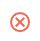
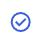
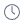
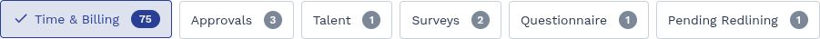
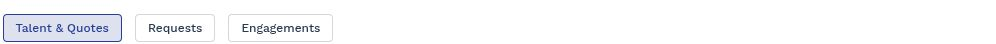
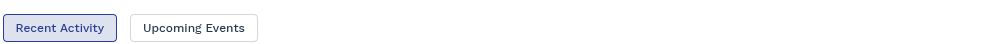
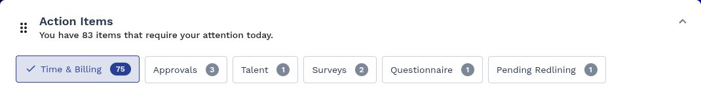
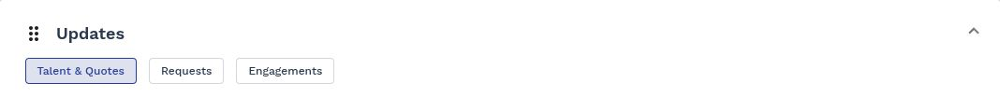
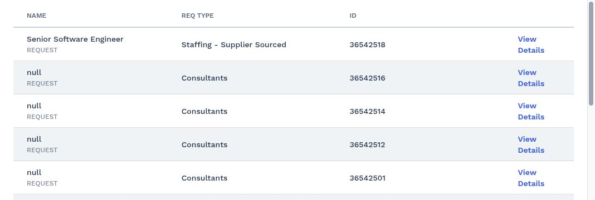

# Accessibility Audit Report

**URL:** https://prodtest3.prounlimited.com/wand/app/manager/index.html#/manager/home  
**Date:** November 11, 2025  
**Compliance Standard:** WCAG 2.1 AA  
**Browser:** Chromium Desktop  
**Total Violations:** 5  
**Total Affected Nodes:** 53  
**Screenshots Captured:** 37

---

## 1. Executive Summary

### Accessibility Score: 60.00/100

The application presents significant accessibility barriers that prevent users with disabilities from effectively navigating and interacting with the interface. The audit identified **5 distinct WCAG 2.1 AA violations** affecting **53 individual elements** across the page.

### Impact Distribution

- **Critical:** 2 violations (40%)
- **Serious:** 3 violations (60%)
- **Moderate:** 0 violations (0%)
- **Minor:** 0 violations (0%)

### High-Level Thematic Issues

The most pervasive issues relate to:

1. **Missing Alternative Text:** Images lack descriptive alt attributes, making visual content inaccessible to screen reader users
2. **Unlabeled Interactive Controls:** Buttons with icon-only interfaces lack accessible names, preventing screen reader users from understanding their purpose
3. **ARIA Implementation Gaps:** ARIA input fields (mat-chip-list components) lack accessible names
4. **Nested Interactive Controls:** Expansion panel headers contain nested focusable elements, creating keyboard navigation confusion
5. **Keyboard Accessibility:** Scrollable regions lack proper keyboard access mechanisms

---

## 2. Score & Issue Overview

| Metric | Count | Percentage |
|--------|-------|------------|
| **Accessibility Score** | 60.00/100 | — |
| **Total Violations** | 5 | 100% |
| **Critical** | 2 | 40% |
| **Serious** | 3 | 60% |
| **Moderate** | 0 | 0% |
| **Minor** | 0 | 0% |
| **Total Affected Nodes** | 53 | — |

---

## 3. Detailed Violations

### Critical Violation: button-name

- **Help:** Buttons must have discernible text
- **Description:** Ensure buttons have discernible text
- **Impact:** Critical
- **Affected Nodes:** 10

| # | Selector | HTML Snippet | Failure Summary | Screenshot |
|---|----------|--------------|-----------------|------------|
| 1 | `.action-item-row.fl-gap-4.fl-item-center:nth-child(1) > .actions-column.column-6.fl-justify-end > .reject-btn.mat-icon-button[mattooltipposition="above"]` | `<button _ngcontent-ng-c4198505905="" mat-icon-button="" mattooltipposition="above" class="mat-focus-indicator mat-tooltip-trigger reject-btn mat-icon-button ma...` | Fix any of the following: Element does not have inner text that is visible to screen readers aria-label attribute does not exist or is empty aria-labelledby attribute does not exist, references elements that do not exist or references elements that are empty Element has no title attribute Element does not have an implicit (wrapped) <label> Element does not have an explicit <label> Element's default semantics were not overridden with role="none" or role="presentation" |  |
| 2 | `.action-item-row.fl-gap-4.fl-item-center:nth-child(1) > .actions-column.column-6.fl-justify-end > .approve-btn.mat-icon-button[mattooltipposition="above"]` | `<button _ngcontent-ng-c4198505905="" mat-icon-button="" mattooltipposition="above" class="mat-focus-indicator mat-tooltip-trigger approve-btn mat-icon-button m...` | Fix any of the following: Element does not have inner text that is visible to screen readers aria-label attribute does not exist or is empty aria-labelledby attribute does not exist, references elements that do not exist or references elements that are empty Element has no title attribute Element does not have an implicit (wrapped) <label> Element does not have an explicit <label> Element's default semantics were not overridden with role="none" or role="presentation" |  |
| 3 | `.action-item-row.fl-gap-4.fl-item-center:nth-child(2) > .actions-column.column-6.fl-justify-end > .reject-btn.mat-icon-button[mattooltipposition="above"]` | `<button _ngcontent-ng-c4198505905="" mat-icon-button="" mattooltipposition="above" class="mat-focus-indicator mat-tooltip-trigger reject-btn mat-icon-button ma...` | Fix any of the following: Element does not have inner text that is visible to screen readers aria-label attribute does not exist or is empty aria-labelledby attribute does not exist, references elements that do not exist or references elements that are empty Element has no title attribute Element does not have an implicit (wrapped) <label> Element does not have an explicit <label> Element's default semantics were not overridden with role="none" or role="presentation" |  |
| 4 | `.action-item-row.fl-gap-4.fl-item-center:nth-child(2) > .actions-column.column-6.fl-justify-end > .approve-btn.mat-icon-button[mattooltipposition="above"]` | `<button _ngcontent-ng-c4198505905="" mat-icon-button="" mattooltipposition="above" class="mat-focus-indicator mat-tooltip-trigger approve-btn mat-icon-button m...` | Fix any of the following: Element does not have inner text that is visible to screen readers aria-label attribute does not exist or is empty aria-labelledby attribute does not exist, references elements that do not exist or references elements that are empty Element has no title attribute Element does not have an implicit (wrapped) <label> Element does not have an explicit <label> Element's default semantics were not overridden with role="none" or role="presentation" |  |
| 5 | `.action-item-row.fl-gap-4.fl-item-center:nth-child(3) > .actions-column.column-6.fl-justify-end > .reject-btn.mat-icon-button[mattooltipposition="above"]` | `<button _ngcontent-ng-c4198505905="" mat-icon-button="" mattooltipposition="above" class="mat-focus-indicator mat-tooltip-trigger reject-btn mat-icon-button ma...` | Fix any of the following: Element does not have inner text that is visible to screen readers aria-label attribute does not exist or is empty aria-labelledby attribute does not exist, references elements that do not exist or references elements that are empty Element has no title attribute Element does not have an implicit (wrapped) <label> Element does not have an explicit <label> Element's default semantics were not overridden with role="none" or role="presentation" |  |
| 6 | `.action-item-row.fl-gap-4.fl-item-center:nth-child(3) > .actions-column.column-6.fl-justify-end > .approve-btn.mat-icon-button[mattooltipposition="above"]` | `<button _ngcontent-ng-c4198505905="" mat-icon-button="" mattooltipposition="above" class="mat-focus-indicator mat-tooltip-trigger approve-btn mat-icon-button m...` | Fix any of the following: Element does not have inner text that is visible to screen readers aria-label attribute does not exist or is empty aria-labelledby attribute does not exist, references elements that do not exist or references elements that are empty Element has no title attribute Element does not have an implicit (wrapped) <label> Element does not have an explicit <label> Element's default semantics were not overridden with role="none" or role="presentation" |  |
| 7 | `.action-item-row.fl-gap-4.fl-item-center:nth-child(4) > .actions-column.column-6.fl-justify-end > .reject-btn.mat-icon-button[mattooltipposition="above"]` | `<button _ngcontent-ng-c4198505905="" mat-icon-button="" mattooltipposition="above" class="mat-focus-indicator mat-tooltip-trigger reject-btn mat-icon-button ma...` | Fix any of the following: Element does not have inner text that is visible to screen readers aria-label attribute does not exist or is empty aria-labelledby attribute does not exist, references elements that do not exist or references elements that are empty Element has no title attribute Element does not have an implicit (wrapped) <label> Element does not have an explicit <label> Element's default semantics were not overridden with role="none" or role="presentation" |  |
| 8 | `.action-item-row.fl-gap-4.fl-item-center:nth-child(4) > .actions-column.column-6.fl-justify-end > .approve-btn.mat-icon-button[mattooltipposition="above"]` | `<button _ngcontent-ng-c4198505905="" mat-icon-button="" mattooltipposition="above" class="mat-focus-indicator mat-tooltip-trigger approve-btn mat-icon-button m...` | Fix any of the following: Element does not have inner text that is visible to screen readers aria-label attribute does not exist or is empty aria-labelledby attribute does not exist, references elements that do not exist or references elements that are empty Element has no title attribute Element does not have an implicit (wrapped) <label> Element does not have an explicit <label> Element's default semantics were not overridden with role="none" or role="presentation" |  |
| 9 | `.expanding-row > .actions-column.column-6.fl-justify-end > .reject-btn.mat-icon-button[mattooltipposition="above"]` | `<button _ngcontent-ng-c4198505905="" mat-icon-button="" mattooltipposition="above" class="mat-focus-indicator mat-tooltip-trigger reject-btn mat-icon-button ma...` | Fix any of the following: Element does not have inner text that is visible to screen readers aria-label attribute does not exist or is empty aria-labelledby attribute does not exist, references elements that do not exist or references elements that are empty Element has no title attribute Element does not have an implicit (wrapped) <label> Element does not have an explicit <label> Element's default semantics were not overridden with role="none" or role="presentation" |  |
| 10 | `.expanding-row > .actions-column.column-6.fl-justify-end > .approve-btn.mat-icon-button[mattooltipposition="above"]` | `<button _ngcontent-ng-c4198505905="" mat-icon-button="" mattooltipposition="above" class="mat-focus-indicator mat-tooltip-trigger approve-btn mat-icon-button m...` | Fix any of the following: Element does not have inner text that is visible to screen readers aria-label attribute does not exist or is empty aria-labelledby attribute does not exist, references elements that do not exist or references elements that are empty Element has no title attribute Element does not have an implicit (wrapped) <label> Element does not have an explicit <label> Element's default semantics were not overridden with role="none" or role="presentation" |  |

#### Why This Matters

Icon-only buttons without accessible names are completely unusable for screen reader users. When a screen reader encounters these buttons, it announces only "button" without any context about the button's purpose. Users cannot determine whether the button will approve, reject, or perform another action. This violates WCAG 2.1 Success Criterion 4.1.2 (Name, Role, Value) at Level A.

The presence of `mattooltipposition="above"` suggests tooltips are intended for visual users, but tooltips are not accessible to screen readers unless properly implemented with ARIA attributes.

#### How to Fix

1. **Add aria-label attributes** to each button with descriptive text:
   ```html
   <button mat-icon-button 
           mattooltipposition="above"
           aria-label="Reject action item"
           class="reject-btn">
   ```

2. **Or use aria-labelledby** to reference visible tooltip text if tooltips are implemented with IDs:
   ```html
   <button mat-icon-button 
           mattooltipposition="above"
           aria-labelledby="reject-tooltip-1"
           class="reject-btn">
   ```

3. **Ensure tooltip content is accessible** by using Angular Material's `matTooltip` directive, which automatically creates accessible descriptions

4. **Verify the accessible name** includes context about which item is being approved/rejected (e.g., "Reject timesheet for John Doe")

#### Validation Checklist

- [ ] All icon-only buttons have aria-label or aria-labelledby attributes
- [ ] Accessible names describe the button's action clearly and concisely
- [ ] Screen reader announces meaningful text when focusing each button
- [ ] Accessible names include context about the specific item being acted upon
- [ ] Tooltips remain visible for visual users while ARIA labels serve screen reader users
- [ ] Test with NVDA/JAWS to verify button announcements

---

### Critical Violation: image-alt

- **Help:** Images must have alternative text
- **Description:** Ensure  elements have alternative text or a role of none or presentation
- **Impact:** Critical
- **Affected Nodes:** 20

| # | Selector | HTML Snippet | Failure Summary | Screenshot |
|---|----------|--------------|-----------------|------------|
| 1 | `.profile-photo` | `` | Fix any of the following: Element does not have an alt attribute aria-label attribute does not exist or is empty aria-labelledby attribute does not exist, references elements that do not exist or references elements that are empty Element has no title attribute Element's default semantics were not overridden with role="none" or role="presentation" |  |
| 2 | `.action-item-row.fl-gap-4.fl-item-center:nth-child(1) > .column-1.fl-flex[_ngcontent-ng-c4198505905=""] > .fl-gap-2.fl-item-center[_ngcontent-ng-c4198505905=""] > img` | `` | Fix any of the following: Element does not have an alt attribute aria-label attribute does not exist or is empty aria-labelledby attribute does not exist, references elements that do not exist or references elements that are empty Element has no title attribute Element's default semantics were not overridden with role="none" or role="presentation" |  |
| 3 | `.action-item-row.fl-gap-4.fl-item-center:nth-child(1) > .actions-column.column-6.fl-justify-end > .reject-btn.mat-icon-button[mattooltipposition="above"] > .mat-button-wrapper > img` | `` | Fix any of the following: Element does not have an alt attribute aria-label attribute does not exist or is empty aria-labelledby attribute does not exist, references elements that do not exist or references elements that are empty Element has no title attribute Element's default semantics were not overridden with role="none" or role="presentation" |  |
| 4 | `.action-item-row.fl-gap-4.fl-item-center:nth-child(1) > .actions-column.column-6.fl-justify-end > .approve-btn.mat-icon-button[mattooltipposition="above"] > .mat-button-wrapper > img` | `` | Fix any of the following: Element does not have an alt attribute aria-label attribute does not exist or is empty aria-labelledby attribute does not exist, references elements that do not exist or references elements that are empty Element has no title attribute Element's default semantics were not overridden with role="none" or role="presentation" |  |
| 5 | `.action-item-row.fl-gap-4.fl-item-center:nth-child(2) > .column-1.fl-flex[_ngcontent-ng-c4198505905=""] > .fl-gap-2.fl-item-center[_ngcontent-ng-c4198505905=""] > img` | `` | Fix any of the following: Element does not have an alt attribute aria-label attribute does not exist or is empty aria-labelledby attribute does not exist, references elements that do not exist or references elements that are empty Element has no title attribute Element's default semantics were not overridden with role="none" or role="presentation" |  |

**Remaining nodes (6-20):** 15 additional images follow the same pattern—time icons, reject/approve button icons, and manager-viewed status icons—all lacking alternative text.

#### Why This Matters

Images without alternative text are invisible to screen reader users. When a screen reader encounters an image without an alt attribute, it either announces the filename (e.g., "icon underscore time dot svg") or skips the image entirely. Both outcomes prevent users from understanding the visual content.

The profile photo, status icons, and action button icons all convey important information that is completely inaccessible to users who cannot see them. This violates WCAG 2.1 Success Criterion 1.1.1 (Non-text Content) at Level A.

#### How to Fix

1. **Profile photo** - Add meaningful alt text or mark as decorative:
   ```html
   
   ```

2. **Decorative icons within labeled buttons** - Use empty alt attribute since the button itself should have an aria-label:
   ```html
   <button aria-label="Reject action item">
     
   </button>
   ```

3. **Status indicators** (time icons, manager-viewed icons) - Provide descriptive alt text:
   ```html
   
   
   ```

4. **Repeated icons** - Use consistent, concise alt text across all instances

#### Validation Checklist

- [ ] All images have alt attributes (even if empty for decorative images)
- [ ] Informational images have descriptive alt text
- [ ] Decorative images within labeled controls use alt=""
- [ ] Alt text is concise and describes the image's purpose, not its appearance
- [ ] Screen reader announces meaningful information for all images
- [ ] Test with screen reader to verify appropriate announcements

---

### Serious Violation: aria-input-field-name

- **Help:** ARIA input fields must have an accessible name
- **Description:** Ensure every ARIA input field has an accessible name
- **Impact:** Serious
- **Affected Nodes:** 3

| # | Selector | HTML Snippet | Failure Summary | Screenshot |
|---|----------|--------------|-----------------|------------|
| 1 | `#mat-chip-list-2` | `<mat-chip-list _ngcontent-ng-c40649...="" ngskiphydration="" selectable="true" multiple="false" class="mat-chip-list ng-sta..." id="mat-chip-list-2" tabindex="0" aria-r...` | Fix any of the following: aria-label attribute does not exist or is empty aria-labelledby attribute does not exist, references elements that do not exist or references elements that are empty Element has no title attribute |  |
| 2 | `#mat-chip-list-0` | `<mat-chip-list _ngcontent-ng-c28878...="" ngskiphydration="" selectable="true" multiple="false" class="mat-chip-list filter..." id="mat-chip-list-0" tabindex="0" aria-r...` | Fix any of the following: aria-label attribute does not exist or is empty aria-labelledby attribute does not exist, references elements that do not exist or references elements that are empty Element has no title attribute |  |
| 3 | `#mat-chip-list-1` | `<mat-chip-list _ngcontent-ng-c19279...="" ngskiphydration="" selectable="true" multiple="false" class="mat-chip-list filter..." id="mat-chip-list-1" tabindex="0" aria-r...` | Fix any of the following: aria-label attribute does not exist or is empty aria-labelledby attribute does not exist, references elements that do not exist or references elements that are empty Element has no title attribute |  |

#### Why This Matters

ARIA input fields with `role="listbox"` (as indicated by the Angular Material chip list implementation) must have accessible names so screen reader users can identify the purpose of the control. Without an accessible name, screen readers announce only the role ("listbox") without any context about what the user is selecting or filtering.

These chip lists appear to be filter controls, but screen reader users cannot determine what data they're filtering. This violates WCAG 2.1 Success Criterion 4.1.2 (Name, Role, Value) at Level A.

#### How to Fix

1. **Add aria-label to each mat-chip-list** with a descriptive name:
   ```html
   <mat-chip-list aria-label="Filter by status" 
                   selectable="true" 
                   multiple="false">
   ```

2. **Or use aria-labelledby** to reference a visible label:
   ```html
   <label id="status-filter-label">Status Filter</label>
   <mat-chip-list aria-labelledby="status-filter-label" 
                   selectable="true" 
                   multiple="false">
   ```

3. **Identify the purpose of each chip list** (e.g., status filter, date range, category) and provide specific labels

4. **Consider Angular Material's matChipListbox** if using newer versions, which includes better accessibility support

#### Validation Checklist

- [ ] All mat-chip-list components have aria-label or aria-labelledby
- [ ] Labels describe the filter or selection purpose clearly
- [ ] Screen reader announces the purpose before announcing individual chips
- [ ] Labels are unique if multiple chip lists appear on the same page
- [ ] Test with screen reader to verify appropriate context

---

### Serious Violation: nested-interactive

- **Help:** Interactive controls must not be nested
- **Description:** Ensure interactive controls are not nested as they are not always announced by screen readers or can cause focus problems for assistive technologies
- **Impact:** Serious
- **Affected Nodes:** 3

| # | Selector | HTML Snippet | Failure Summary | Screenshot |
|---|----------|--------------|-----------------|------------|
| 1 | `#mat-expansion-panel-header-0` | `<mat-expansion-panel-header _ngcontent-ng-c40649...="" role="button" class="mat-expansion-panel-..." id="mat-expansion-panel-..." tabindex="0" aria-controls="cdk-acc...` | Fix any of the following: Element has focusable descendants |  |
| 2 | `#mat-expansion-panel-header-1` | `<mat-expansion-panel-header _ngcontent-ng-c28878...="" role="button" class="mat-expansion-panel-..." id="mat-expansion-panel-..." tabindex="0" aria-controls="cdk-acc...` | Fix any of the following: Element has focusable descendants |  |
| 3 | `#mat-expansion-panel-header-2` | `<mat-expansion-panel-header _ngcontent-ng-c19279...="" role="button" class="mat-expansion-panel-..." id="mat-expansion-panel-..." tabindex="0" aria-controls="cdk-acc...` | Fix any of the following: Element has focusable descendants |  |

#### Why This Matters

Expansion panel headers with `role="button"` contain nested focusable elements (likely the chip lists from the previous violation). This creates keyboard navigation confusion and can cause issues with assistive technologies:

- Screen readers may not announce the nested interactive controls properly
- Keyboard users cannot tab to the nested controls reliably
- The focus order becomes unpredictable
- Some screen readers treat the entire area as a single button, hiding the nested controls

This violates WCAG 2.1 Success Criterion 4.1.2 (Name, Role, Value) and impacts keyboard navigation patterns required by 2.1.1 (Keyboard).

#### How to Fix

1. **Move interactive controls outside the expansion panel header**:
   ```html
   <mat-expansion-panel-header role="button">
     <!-- Header content only - no interactive elements -->
   </mat-expansion-panel-header>
   <div class="panel-content">
     <!-- Place chip lists and other interactive controls here -->
     <mat-chip-list aria-label="Filter options">...</mat-chip-list>
   </div>
   ```

2. **Or restructure to remove button role from parent** if the Angular Material API allows:
   ```html
   <div class="custom-expansion-header" (click)="togglePanel()">
     <mat-chip-list aria-label="Filter">...</mat-chip-list>
     <button aria-label="Expand panel">
       <mat-icon>expand_more</mat-icon>
     </button>
   </div>
   ```

3. **Use event propagation control** to prevent conflicts:
   ```typescript
   onChipClick(event: MouseEvent) {
     event.stopPropagation(); // Prevent expansion panel toggle
   }
   ```

4. **Consider UX redesign** to place filters outside expansion panels entirely, which would improve both accessibility and usability

#### Validation Checklist

- [ ] Expansion panel headers contain no focusable descendants
- [ ] All interactive controls can be reached via keyboard navigation
- [ ] Tab order is logical and sequential
- [ ] Screen reader announces all interactive controls separately
- [ ] Click/touch targets do not conflict with nested controls
- [ ] Test with keyboard-only navigation to verify no focus traps

---

### Serious Violation: scrollable-region-focusable

- **Help:** Scrollable region must have keyboard access
- **Description:** Ensure elements that have scrollable content are accessible by keyboard
- **Impact:** Serious
- **Affected Nodes:** 1

| # | Selector | HTML Snippet | Failure Summary | Screenshot |
|---|----------|--------------|-----------------|------------|
| 1 | `.recently-view-grid-container` | `<section _ngcontent-ng-c1282121344="" class="recently-view-grid-container fl-flex fl-flex-col fl-place-content-between">` | Fix any of the following: Element should have focusable content Element should be focusable |  |

#### Why This Matters

Scrollable regions that cannot receive keyboard focus are inaccessible to keyboard-only users and screen reader users. When content overflows and creates a scrollbar, users must be able to focus the container and scroll with arrow keys, Page Up/Down, or other keyboard commands.

Without keyboard access, users who cannot use a mouse are unable to view content that extends beyond the visible area. This violates WCAG 2.1 Success Criterion 2.1.1 (Keyboard) at Level A.

#### How to Fix

1. **Make the container focusable** by adding `tabindex="0"`:
   ```html
   <section class="recently-view-grid-container fl-flex fl-flex-col fl-place-content-between"
            tabindex="0"
            role="region"
            aria-label="Recently viewed items">
   ```

2. **Add an accessible name** using `aria-label` or `aria-labelledby`:
   ```html
   <h2 id="recent-heading">Recently Viewed</h2>
   <section class="recently-view-grid-container fl-flex fl-flex-col fl-place-content-between"
            tabindex="0"
            role="region"
            aria-labelledby="recent-heading">
   ```

3. **Ensure focusable child elements** are keyboard accessible:
   ```typescript
   // Verify all interactive elements within the scrollable region have proper focus management
   ```

4. **Add focus styles** to indicate when the container has focus:
   ```css
   .recently-view-grid-container:focus {
     outline: 2px solid #0066cc;
     outline-offset: 2px;
   }
   ```

#### Validation Checklist

- [ ] Scrollable container can receive keyboard focus
- [ ] Container has an accessible name (aria-label or aria-labelledby)
- [ ] Focus indicator is visible when container is focused
- [ ] Arrow keys scroll the container when focused
- [ ] Tab key moves through focusable children correctly
- [ ] Test with keyboard-only navigation to verify scroll access

---

## 4. Root Cause Analysis

| Area | Issue | Root Cause | Recommended Action |
|------|-------|------------|-------------------|
| Icon Buttons | 10 buttons lack accessible names | Angular Material mat-icon-button components rendered without aria-label or aria-labelledby attributes | Add aria-label attributes to all icon-only buttons in action item rows with contextual descriptions |
| Images | 20 images missing alt attributes | SVG icons and profile photos rendered without alt attributes in component templates | Add alt attributes to all `` elements; use alt="" for decorative images within labeled buttons |
| ARIA Components | 3 chip lists lack accessible names | mat-chip-list components initialized without aria-label or aria-labelledby configuration | Configure aria-label for each mat-chip-list component to describe its filtering purpose |
| Expansion Panels | 3 expansion headers contain nested interactive controls | Chip list filter controls placed inside mat-expansion-panel-header elements | Restructure layout to move chip lists outside expansion panel headers or into panel content area |
| Scrollable Regions | 1 scrollable container inaccessible to keyboard | Recently viewed section implements overflow scrolling without tabindex or role="region" | Add tabindex="0", role="region", and aria-label to scrollable container |

---

## 5. Prioritized Remediation Plan

| Priority | Task | Impact Addressed | Effort | Notes |
|----------|------|------------------|--------|-------|
| **High** | Add aria-label to all 10 action item buttons | Critical: button-name violation (10 nodes) | Low | Quick template update; ensure labels include context about which item is being approved/rejected |
| **High** | Add alt attributes to all 20 images | Critical: image-alt violation (20 nodes) | Low | Template update; use alt="" for decorative icons in buttons, descriptive text for status icons |
| **High** | Add aria-label to 3 mat-chip-list components | Serious: aria-input-field-name violation (3 nodes) | Low | Identify filter purpose for each chip list and add appropriate aria-label |
| **Medium** | Restructure expansion panels to remove nested interactive controls | Serious: nested-interactive violation (3 nodes) | Medium | Requires component refactoring; move chip lists outside panel headers or redesign filter placement |
| **Medium** | Make scrollable "Recently Viewed" section keyboard accessible | Serious: scrollable-region-focusable violation (1 node) | Low | Add tabindex="0", role="region", and aria-labelledby to scrollable container |
| **Low** | Add visible focus indicators for all interactive elements | Improves usability across all violations | Medium | CSS updates to ensure focus states are clearly visible for keyboard navigation |
| **Low** | Conduct comprehensive screen reader testing | Validate all fixes | Medium | Test with NVDA and JAWS on Windows, VoiceOver on macOS/iOS |

---

## 6. Testing & Verification Plan

1. **Automated Re-scan:** Run axe-core audit again after implementing fixes to verify violation count drops to zero

2. **Manual Keyboard Testing:**
   - Navigate entire page using only Tab, Shift+Tab, Enter, Space, and Arrow keys
   - Verify all interactive elements are reachable and operable
   - Confirm focus indicators are visible at all times
   - Test scrollable region with keyboard-only navigation

3. **Screen Reader Testing:**
   - Test with NVDA (Windows) and VoiceOver (macOS)
   - Verify all buttons announce their purpose clearly
   - Confirm images announce appropriate alternative text
   - Validate chip list filters announce their purpose before listing options
   - Ensure expansion panels and nested content are navigable

4. **Visual Inspection:**
   - Review all screenshots to confirm visual appearance matches accessibility implementation
   - Verify tooltips remain visible for sighted users
   - Confirm focus indicators do not interfere with UI layout

5. **User Testing:**
   - Conduct testing with actual users who rely on assistive technologies
   - Gather feedback on clarity of button labels and alt text
   - Validate that contextual information is sufficient for task completion

6. **Regression Testing:**
   - Test existing functionality to ensure accessibility fixes do not break visual appearance or interactions
   - Verify Angular Material components still function as expected

7. **Cross-Browser Validation:**
   - Test in Chrome, Firefox, Edge, and Safari
   - Verify accessibility tree in browser DevTools
   - Confirm ARIA attributes are properly exposed

8. **Documentation Review:**
   - Update component documentation with accessibility requirements
   - Create accessibility checklist for future development
   - Document ARIA patterns used for Angular Material components

---

## 7. Developer Implementation Checklist

### Button Accessibility (Critical Priority)

- [ ] **Pending:** Add aria-label="Reject [item name]" to all .reject-btn elements
- [ ] **Pending:** Add aria-label="Approve [item name]" to all .approve-btn elements
- [ ] **Pending:** Ensure aria-label includes context about specific action item being acted upon
- [ ] **Pending:** Verify tooltips remain functional after adding aria-label attributes
- [ ] **Pending:** Test button announcements with screen reader

### Image Accessibility (Critical Priority)

- [ ] **Pending:** Add alt="User profile photo" to .profile-photo image
- [ ] **Pending:** Add alt="" to all icon images within labeled buttons (decorative)
- [ ] **Pending:** Add alt="Time submitted" to icon_time.svg images
- [ ] **Pending:** Add alt="Reject" to icon_reject.svg images in buttons (if buttons lack aria-label)
- [ ] **Pending:** Add alt="Approve" to icon_approve.svg images in buttons (if buttons lack aria-label)
- [ ] **Pending:** Add alt="Viewed by manager" to icon_manager_viewed.svg images
- [ ] **Pending:** Review all images to determine which are informational vs. decorative
- [ ] **Pending:** Test image announcements with screen reader

### ARIA Input Field Accessibility (High Priority)

- [ ] **Pending:** Add aria-label to #mat-chip-list-0 describing its filter purpose
- [ ] **Pending:** Add aria-label to #mat-chip-list-1 describing its filter purpose
- [ ] **Pending:** Add aria-label to #mat-chip-list-2 describing its filter purpose
- [ ] **Pending:** Test chip list announcements with screen reader
- [ ] **Pending:** Verify keyboard navigation through chip options

### Nested Interactive Controls (Medium Priority)

- [ ] **Pending:** Analyze expansion panel structure and identify nested interactive elements
- [ ] **Pending:** Move chip lists from inside mat-expansion-panel-header to panel content area
- [ ] **Pending:** Or restructure UI to place filters outside expansion panels
- [ ] **Pending:** Update click handlers to prevent event propagation conflicts
- [ ] **Pending:** Test keyboard navigation through expansion panels
- [ ] **Pending:** Verify screen reader announces all controls appropriately

### Scrollable Region Accessibility (Medium Priority)

- [ ] **Pending:** Add tabindex="0" to .recently-view-grid-container element
- [ ] **Pending:** Add role="region" to .recently-view-grid-container element
- [ ] **Pending:** Add aria-label="Recently viewed items" or aria-labelledby reference
- [ ] **Pending:** Add CSS focus styles for scrollable container
- [ ] **Pending:** Test keyboard scrolling with arrow keys and Page Up/Down

### General Quality Assurance

- [ ] **Pending:** Run automated axe-core audit to verify all violations resolved
- [ ] **Pending:** Conduct full keyboard-only navigation test
- [ ] **Pending:** Test with NVDA screen reader (Windows)
- [ ] **Pending:** Test with JAWS screen reader (Windows)
- [ ] **Pending:** Test with VoiceOver screen reader (macOS)
- [ ] **Pending:** Verify focus indicators visible throughout entire page
- [ ] **Pending:** Test in Chrome, Firefox, Edge, and Safari browsers
- [ ] **Pending:** Review Angular Material documentation for accessibility best practices
- [ ] **Pending:** Document accessibility patterns for future component development

---

## 8. Appendix

### WCAG 2.1 Success Criteria References

- **1.1.1 Non-text Content (Level A):** All non-text content presented to the user has a text alternative that serves the equivalent purpose
  - https://www.w3.org/WAI/WCAG21/Understanding/non-text-content.html

- **2.1.1 Keyboard (Level A):** All functionality of the content is operable through a keyboard interface
  - https://www.w3.org/WAI/WCAG21/Understanding/keyboard.html

- **4.1.2 Name, Role, Value (Level A):** For all user interface components, the name and role can be programmatically determined
  - https://www.w3.org/WAI/WCAG21/Understanding/name-role-value.html

### Tools & Resources

- **Axe DevTools:** Browser extension for automated accessibility testing
  - https://www.deque.com/axe/devtools/

- **ARIA Authoring Practices Guide (APG):** W3C guidance for implementing ARIA patterns
  - https://www.w3.org/WAI/ARIA/apg/

- **Angular Material Accessibility:** Official documentation for accessible Angular Material components
  - https://material.angular.io/guide/accessibility

- **NVDA Screen Reader:** Free screen reader for Windows
  - https://www.nvaccess.org/

- **axe-core Documentation:** Open-source accessibility testing engine
  - https://github.com/dequelabs/axe-core

- **WebAIM:** Comprehensive accessibility resources and testing tools
  - https://webaim.org/

---

## 9. Final Notes

### Highest-Leverage Fixes

The three highest-impact, lowest-effort fixes that will dramatically improve accessibility:

1. **Add aria-label attributes to all 10 icon buttons** - Resolves a critical barrier preventing screen reader users from understanding and using core action functionality

2. **Add alt attributes to all 20 images** - Provides essential context about visual content and status indicators that are currently invisible to screen reader users

3. **Add aria-label to 3 chip list filter components** - Enables screen reader users to understand and use the filtering functionality

These three fixes address **33 out of 53 affected nodes (62%)** and resolve **2 critical violations**, requiring minimal development effort (primarily template updates with no logic changes).

### Next Re-test Trigger

Schedule the next accessibility audit after completing the Developer Implementation Checklist above. The audit should verify:

- Violation count reduced to zero
- Accessibility score improved to 90+ out of 100
- All interactive elements are keyboard accessible
- All content is perceivable by screen readers
- Focus management follows logical patterns

### Long-term Recommendations

- **Establish accessibility review process** for all new features before merge
- **Integrate automated testing** into CI/CD pipeline with axe-core
- **Create component library standards** documenting ARIA requirements for reusable components
- **Schedule quarterly audits** to catch regressions and new issues
- **Provide team training** on WCAG 2.1 AA requirements and Angular Material accessibility patterns
- **Consider user testing** with people who use assistive technologies to validate real-world usability

---

**Report Generated:** November 11, 2025  
**Audit Tool:** Axe-core (WCAG 2.1 AA compliance)  
**Browser:** Chromium Desktop
