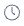
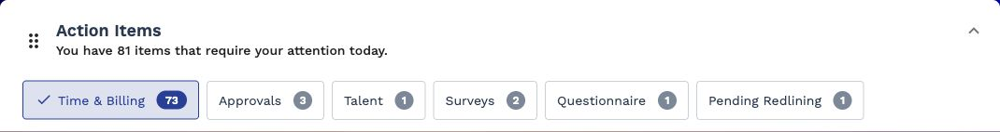
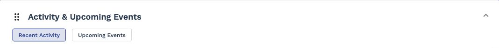
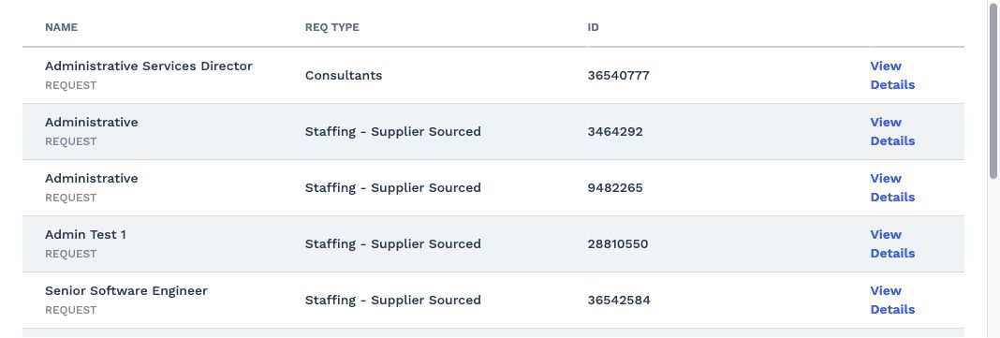

# Accessibility Audit Report

URL: https://prodtest3.prounlimited.com/wand/app/manager/index.html#/manager/home  
Date (Generated): November 12, 2025  
Audit Timestamp (UTC): 2025-11-12T16:33:28.324Z  
Compliance Target: WCAG 2.1 AA  
Browser: Chromium Desktop  
Total Violations: 5  
Total Affected Nodes: 37  
Accessibility Score: 65.00

Impact Distribution: Critical 2 (40%) • Serious 3 (60%) • Moderate 0 (0%) • Minor 0 (0%)

---
## 1. Executive Summary
- Score 65.00 indicates substantial remediation required for core perceivability & operability.
- 5 distinct rule violations affecting 37 nodes; concentration in non-text alternatives and control labeling.
- High-impact issues: missing alternative text on 20 images; icon-only buttons (10) without accessible names; unlabeled ARIA chip list inputs; improper interactive structure (nested controls); one scrollable region lacking keyboard focusability.
- Thematic Patterns:
  - Missing accessible names (buttons, ARIA listboxes)
  - Non-text content lacking alt text
  - Structural semantics causing focus / announcement ambiguity
  - Keyboard accessibility gap for scrollable region
- Highest Leverage Fixes: establish labeling patterns for interactive controls; batch alt text additions; refactor expansion panel header internals; ensure focusability of custom scroll region.

## 2. Score & Issue Overview
| Metric | Value |
|--------|-------|
| Accessibility Score | 65.00 |
| Total Violations | 5 |
| Critical | 2 |
| Serious | 3 |
| Moderate | 0 |
| Minor | 0 |
| Total Affected Nodes | 37 |

## 3. Detailed Violations

### Critical Violation: button-name
- Help: Buttons must have discernible text
- Description: Ensure buttons have discernible text
- Impact: critical
- Affected Nodes: 10

| # | Selector | HTML Snippet | Failure Summary | Screenshot |
|---|----------|--------------|-----------------|------------|
|1|.action-item-row.fl-gap-4.fl-item-center:nth-child(1) > .actions-column.column-6.fl-justify-end > .reject-btn.mat-icon-button[mattooltipposition="above"]|<button _ngcontent-ng-c4198505905="" mat-icon-button="" mattooltipposition="above" class="mat-focus-indicator ...>|Element does not have inner text that is visible to screen readers||
|2|.action-item-row.fl-gap-4.fl-item-center:nth-child(1) > .actions-column.column-6.fl-justify-end > .approve-btn.mat-icon-button[mattooltipposition="above"]|<button _ngcontent-ng-c4198505905="" mat-icon-button="" mattooltipposition="above" class="mat-focus-indicator ...>|Element does not have inner text that is visible to screen readers||
|3|.action-item-row.fl-gap-4.fl-item-center:nth-child(2) > .actions-column.column-6.fl-justify-end > .reject-btn.mat-icon-button[mattooltipposition="above"]|<button _ngcontent-ng-c4198505905="" mat-icon-button="" mattooltipposition="above" class="mat-focus-indicator ...>|Element does not have inner text that is visible to screen readers||
|4|.action-item-row.fl-gap-4.fl-item-center:nth-child(2) > .actions-column.column-6.fl-justify-end > .approve-btn.mat-icon-button[mattooltipposition="above"]|<button _ngcontent-ng-c4198505905="" mat-icon-button="" mattooltipposition="above" class="mat-focus-indicator ...>|Element does not have inner text that is visible to screen readers||
|5|.action-item-row.fl-gap-4.fl-item-center:nth-child(3) > .actions-column.column-6.fl-justify-end > .reject-btn.mat-icon-button[mattooltipposition="above"]|<button _ngcontent-ng-c4198505905="" mat-icon-button="" mattooltipposition="above" class="mat-focus-indicator ...>|Element does not have inner text that is visible to screen readers||
|6|.action-item-row.fl-gap-4.fl-item-center:nth-child(3) > .actions-column.column-6.fl-justify-end > .approve-btn.mat-icon-button[mattooltipposition="above"]|<button _ngcontent-ng-c4198505905="" mat-icon-button="" mattooltipposition="above" class="mat-focus-indicator ...>|Element does not have inner text that is visible to screen readers||
|7|.action-item-row.fl-gap-4.fl-item-center:nth-child(4) > .actions-column.column-6.fl-justify-end > .reject-btn.mat-icon-button[mattooltipposition="above"]|<button _ngcontent-ng-c4198505905="" mat-icon-button="" mattooltipposition="above" class="mat-focus-indicator ...>|Element does not have inner text that is visible to screen readers||
|8|.action-item-row.fl-gap-4.fl-item-center:nth-child(4) > .actions-column.column-6.fl-justify-end > .approve-btn.mat-icon-button[mattooltipposition="above"]|<button _ngcontent-ng-c4198505905="" mat-icon-button="" mattooltipposition="above" class="mat-focus-indicator ...>|Element does not have inner text that is visible to screen readers||
|9|.expanding-row > .actions-column.column-6.fl-justify-end > .reject-btn.mat-icon-button[mattooltipposition="above"]|<button _ngcontent-ng-c4198505905="" mat-icon-button="" mattooltipposition="above" class="mat-focus-indicator ...>|Element does not have inner text that is visible to screen readers||
|10|.expanding-row > .actions-column.column-6.fl-justify-end > .approve-btn.mat-icon-button[mattooltipposition="above"]|<button _ngcontent-ng-c4198505905="" mat-icon-button="" mattooltipposition="above" class="mat-focus-indicator ...>|Element does not have inner text that is visible to screen readers||

Why This Matters: Screen reader users rely on programmatic names to understand the purpose of icon-only buttons. Without discernible text, controls are announced generically (e.g. "button"), impeding task completion and increasing cognitive load.

How to Fix:
- Provide meaningful `aria-label` (e.g. "Approve Timesheet", "Reject Timesheet").
- If visible tooltip text exists, expose it via `aria-label` or ensure it is persistent text.
- Use `<button>Approve</button>` pattern if reusing icons.
- Ensure labels are unique where action differs.

Validation Checklist:
- [ ] Each button exposes a non-empty accessible name.
- [ ] Names convey unique action intent.
- [ ] No duplicate ambiguous labels.
- [ ] Tooltip content not relied on exclusively.
- [ ] Icons marked decorative only if redundant with text.

### Critical Violation: image-alt
- Help: Images must have alternative text
- Description: Ensure  elements have alternative text or a role of none or presentation
- Impact: critical
- Affected Nodes: 20

| # | Selector | HTML Snippet | Failure Summary | Screenshot |
|---|----------|--------------|-----------------|------------|
|1|.profile-photo||Element does not have an alt attribute||
|2|...nth-child(1)... > img[src*="icon_time.svg"]||Element does not have an alt attribute||
|3|...nth-child(1)... reject-btn ... > img||Element does not have an alt attribute||
|4|...nth-child(1)... approve-btn ... > img||Element does not have an alt attribute||
|5|...nth-child(2)... > img[src*="icon_time.svg"]||Element does not have an alt attribute||
|6|...nth-child(2)... reject-btn ... > img||Element does not have an alt attribute||
|7|...nth-child(2)... approve-btn ... > img||Element does not have an alt attribute||
|8|...nth-child(3)... > img[src*="icon_time.svg"]||Element does not have an alt attribute||
|9|...nth-child(3)... reject-btn ... > img||Element does not have an alt attribute||
|10|...nth-child(3)... approve-btn ... > img||Element does not have an alt attribute||
|11|...nth-child(4)... > img[src*="icon_time.svg"]||Element does not have an alt attribute||
|12|...nth-child(4)... reject-btn ... > img||Element does not have an alt attribute||
|13|...nth-child(4)... approve-btn ... > img||Element does not have an alt attribute||
|14|.expanding-row ... icon_time.svg||Element does not have an alt attribute||
|15|.expanding-row ... reject-btn ... > img||Element does not have an alt attribute||
|16|.expanding-row ... approve-btn ... > img||Element does not have an alt attribute||
|17|.mat-row:nth-child(1) ... manager-viewed-text > img||Element does not have an alt attribute||
|18|.mat-row:nth-child(3) ... manager-viewed-text > img||Element does not have an alt attribute||
|19|.mat-row:nth-child(4) ... manager-viewed-text > img||Element does not have an alt attribute||
|20|.mat-row:nth-child(5) ... manager-viewed-text > img||Element does not have an alt attribute||

Why This Matters: Alternative text communicates the purpose of images to users who cannot perceive them visually, satisfying WCAG 1.1.1 and enabling assistive technologies to convey equivalent information.

How to Fix:
- Add concise, functional alt text for action icons (e.g. "Reject", "Approve", "Pending Time Entry").
- For purely decorative images, set `alt=""` (empty) or apply `role="presentation"`.
- Apply consistent naming conventions for repeated icons to aid recognition.
- Avoid duplicating nearby visible text—leave decorative duplicates empty.

Validation Checklist:
- [ ] Every meaningful image has descriptive non-empty `alt`.
- [ ] Decorative images have empty `alt`.
- [ ] No file names used as alt text.
- [ ] Icons and their buttons do not produce redundant spoken output.

### Serious Violation: aria-input-field-name
- Help: ARIA input fields must have an accessible name
- Description: Ensure every ARIA input field has an accessible name
- Impact: serious
- Affected Nodes: 3

| # | Selector | HTML Snippet | Failure Summary | Screenshot |
|---|----------|--------------|-----------------|------------|
|1|#mat-chip-list-2|<mat-chip-list ... id="mat-chip-list-2" tabindex="0" aria-required="false" ...>|aria-label attribute does not exist or is empty||
|2|#mat-chip-list-0|<mat-chip-list ... id="mat-chip-list-0" tabindex="0" aria-required="false" ...>|aria-label attribute does not exist or is empty||
|3|#mat-chip-list-1|<mat-chip-list ... id="mat-chip-list-1" tabindex="0" aria-required="false" ...>|aria-label attribute does not exist or is empty||

Why This Matters: Inputs without accessible names are announced generically, obstructing form navigation and filter comprehension for screen reader users.

How to Fix:
- Associate visible label via `aria-labelledby` referencing a persistent text element.
- If no visible text exists, add a concise `aria-label` (e.g. "Status Filters").
- Ensure uniqueness across multiple chip lists (e.g. "Region Filter", "Department Filter").

Validation Checklist:
- [ ] Each chip list announces a unique, meaningful name.
- [ ] No reliance on placeholder text alone.
- [ ] Labels persist when focus enters control.

### Serious Violation: nested-interactive
- Help: Interactive controls must not be nested
- Description: Ensure interactive controls are not nested as they are not always announced by screen readers or can cause focus problems for assistive technologies
- Impact: serious
- Affected Nodes: 3

| # | Selector | HTML Snippet | Failure Summary | Screenshot |
|---|----------|--------------|-----------------|------------|
|1|#mat-expansion-panel-header-0|<mat-expansion-panel-header ... role="button" ... aria-expanded="true" ...>|Element has focusable descendants||
|2|#mat-expansion-panel-header-1|<mat-expansion-panel-header ... role="button" ... aria-expanded="true" ...>|Element has focusable descendants||
|3|#mat-expansion-panel-header-2|<mat-expansion-panel-header ... role="button" ... aria-expanded="true" ...>|Element has focusable descendants||

Why This Matters: Nested focusable elements create multiple tab stops inside a single control, causing inconsistent announcements and potential focus trapping.

How to Fix:
- Remove inner focusable elements (buttons, links) from header; use non-focusable wrappers inside header text.
- Move secondary actions outside the expansion header region.
- Ensure only one tabbable element per interactive header.

Validation Checklist:
- [ ] Expansion header is a single tab stop.
- [ ] Inner elements are not focusable.
- [ ] Keyboard interaction (Enter/Space) toggles panel reliably.

### Serious Violation: scrollable-region-focusable
- Help: Scrollable region must have keyboard access
- Description: Ensure elements that have scrollable content are accessible by keyboard
- Impact: serious
- Affected Nodes: 1

| # | Selector | HTML Snippet | Failure Summary | Screenshot |
|---|----------|--------------|-----------------|------------|
|1|.recently-view-grid-container|<section ... class="recently-view-grid-container fl-flex fl-flex-col ...">|Element should be focusable||

Why This Matters: Keyboard users must be able to focus scrollable regions to scroll content without a pointing device, satisfying WCAG 2.1.1 (Keyboard) and 2.4.3 (Focus Order).

How to Fix:
- Add `tabindex="0"` to the scroll container if no native focus target exists.
- Provide an accessible name (e.g. `aria-label="Recently Viewed"`).
- Avoid disabling native scrolling behaviors.

Validation Checklist:
- [ ] Region receives focus via Tab.
- [ ] Screen reader announces purpose/name.
- [ ] Arrow/Page keys scroll content while focused.

## 4. Color Contrast
No color-contrast violations detected; section omitted.

## 5. Root Cause Analysis
| Area | Issue | Cause | Recommended Action |
|------|-------|-------|--------------------|
| Action Buttons | Missing accessible names | Icon-only implementation without labels | Add `aria-label` or visible text with visually hidden technique |
| Images/Icons | Missing alt text | Lack of alt authoring pattern & inconsistent semantics | Define alt text guidelines; enforce linting in component library |
| Filter Chip Lists | Unlabeled ARIA inputs | Labels not programmatically associated | Bind visible labels via `aria-labelledby`; ensure unique IDs |
| Expansion Panels | Nested interactive elements | Focusable children inside header | Refactor header to contain only static inline elements |
| Scrollable Grid | Not focusable | Custom container lacks tabindex/role | Add `tabindex="0"` and accessible name |

## 6. Prioritized Remediation Plan
| Priority | Task | Impact Addressed | Effort | Notes |
|----------|------|------------------|--------|-------|
| High | Add accessible names to all icon buttons | button-name | Low | Centralized component update |
| High | Provide alt/empty alt for all images/icons | image-alt | Medium | Audit shared icon component |
| High | Label chip list inputs programmatically | aria-input-field-name | Low | Add IDs + `aria-labelledby` |
| Medium | Refactor expansion panel headers (remove nested focusables) | nested-interactive | Medium | Might adjust component API |
| Medium | Make scroll region focusable & named | scrollable-region-focusable | Low | Single DOM change |
| Low | Establish a11y regression tests for new components | All | Medium | Prevent reintroduction |

## 7. Suggested Color Adjustments
Not applicable (no color-contrast violation present).

## 8. Testing & Verification Plan
1. Re-run automated axe-based audit after each remediation batch.
2. Perform keyboard-only navigation: confirm tab order & scrolling behavior.
3. Use screen reader (NVDA/Chrome) to validate button names, alt text, and chip list labels.
4. Toggle expansion panels ensuring single tab stop and proper announcements.
5. Validate recently viewed grid focus and scroll with keyboard.
6. Regression test with automated CI check (axe + playwright) to enforce rules.

## 9. Developer Implementation Checklist
- [ ] Add `aria-label` or text for all approve/reject buttons (Pending)
- [ ] Add `alt` text for semantic images; empty alt for decorative (Pending)
- [ ] Associate chip list elements with visible labels (Pending)
- [ ] Remove nested focusable elements inside expansion panel headers (Pending)
- [ ] Add `tabindex="0"` and `aria-label` to scrollable grid (Pending)
- [ ] Introduce component-level linting / tests for alt & label presence (Pending)
- [ ] Add automated accessibility audit to CI pipeline (Pending)

## 10. Appendix
References:
- WCAG 2.1 Success Criterion 1.1.1 (Non-text Content)
- WCAG 2.1 Success Criterion 1.3.1 (Info and Relationships)
- WCAG 2.1 Success Criterion 2.1.1 (Keyboard)
- WCAG 2.1 Success Criterion 2.4.6 (Headings and Labels)
- ARIA Authoring Practices Guide (APG)
- Axe Core Rule Documentation (button-name, image-alt, aria-input-field-name, nested-interactive, scrollable-region-focusable)

## 11. Final Notes
Addressing button labels, alt text, and ARIA input naming will yield the largest immediate improvement in user experience and score. After implementing prioritized fixes, schedule a re-audit; if score improvement <15 points, conduct manual exploratory testing for latent issues (focus management, announcements). Re-test trigger: completion of all High priority tasks or introduction of new interactive components.
